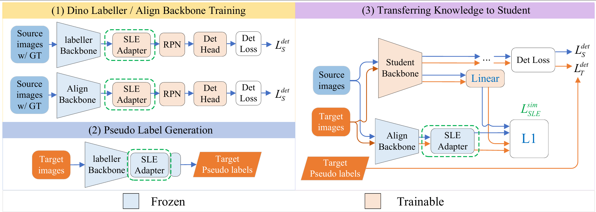

# SLE Teacher

This repository contains the anonymized supplementary implementation of SLE Teacher (SLE-T) for domain-adaptive object detection. It is provided to support the technical claims and reproducibility of the accompanying AAAI submission.

## Method Overview

<p align="center">
  
</p>

**Figure 1.** Overview of SLE-T. An SLE-enhanced teacher is trained with source-domain annotations and then frozen. Its knowledge is transferred to the detector through pseudo-label supervision or feature alignment.

## Environment

The implementation is based on Python, PyTorch, and Detectron2. Install a PyTorch build compatible with the local CUDA runtime, followed by Detectron2 and the remaining Python dependencies required by the source files.

The repository expects Detectron2 to be importable from the active Python environment. No machine-specific installation path is required.

## Datasets

The experiments use the following publicly available datasets:

- Cityscapes
- Foggy Cityscapes
- BDD100K Daytime
- ACDC

Download each dataset from its official distribution page and comply with its license and terms of use. Dataset files are not redistributed in this supplementary package.

Update the dataset roots in the relevant registration modules or configuration files before running an experiment. Use paths relative to the repository whenever possible.

## Repository Structure

| Path | Description |
|---|---|
| `train_net_lt.py` | Main entry point for SLE-T training and evaluation |
| `dinoteacher/engine/trainer.py` | Training procedure and teacher-student optimization |
| `dinoteacher/modeling/` | Model architectures and SLE-related components |
| `dinoteacher/data/` | Dataset registration and data processing |
| `configs/` | Experiment configurations |
| `eval_ap_sml.py` | Evaluation utility |

## Training

Select a configuration matching the intended source-to-target adaptation setting. A typical training command is:

```text
python train_net_lt.py --num-gpus <NUM_GPUS> --stage align_or_pseudo --config-file <CONFIG_PATH> OUTPUT_DIR <OUTPUT_PATH>
```

To train the teacher component, use:

```text
python train_net_lt.py --num-gpus <NUM_GPUS> --stage train_dino --config-file <CONFIG_PATH> OUTPUT_DIR <OUTPUT_PATH>
```

Replace all angle-bracket placeholders with local, non-identifying paths or values. Pretrained weights must be downloaded separately and specified through the selected configuration.

## Evaluation

Evaluate a trained checkpoint with:

```text
python train_net_lt.py --num-gpus <NUM_GPUS> --stage align_or_pseudo --config-file <CONFIG_PATH> --eval-only MODEL.WEIGHTS <CHECKPOINT_PATH>
```

The principal metric is mean average precision at an intersection-over-union threshold of 0.5 (mAP50).

## Reference Results

| Backbone | Model Size (M) | Foggy Cityscapes mAP50 | BDD100K Daytime mAP50 |
|---|---:|---:|---:|
| ViT-B | 86 | 51.8 | 43.8 |
| ViT-L | 300 | 55.4 | 46.6 |
| ViT-G | 1,100 | 57.0 | 50.7 |
| SLE (ViT-B) | 108 | 59.9 | 49.9 |
| SLE (ViT-L) | 322 | **61.3** | **52.6** |

**Table 1.** Model size and teacher performance on Foggy Cityscapes and BDD100K Daytime.

Minor numerical differences may arise from hardware, dependency versions, nondeterministic GPU operations, and random initialization.

## Anonymity and Artifact Scope

This package is prepared for double-blind review. Submission-author identities, affiliations, personal contact details, private repository links, local user paths, training logs, and machine-specific metadata have been removed. Attribution required by third-party licenses is retained. The main paper is self-contained; this artifact provides implementation details and supporting material for reproducibility.

## License

Use of this supplementary implementation is subject to the license included in this repository. Third-party components and datasets remain governed by their respective licenses.
